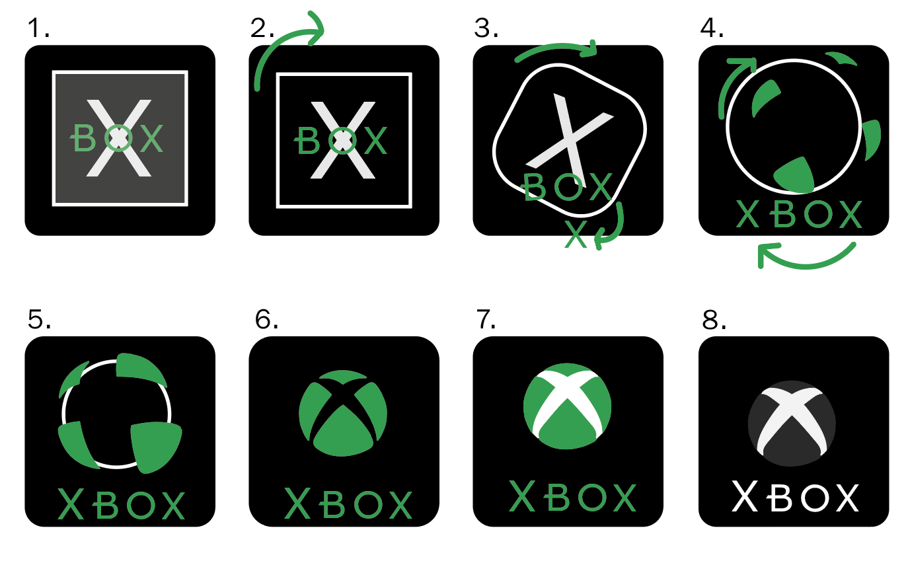
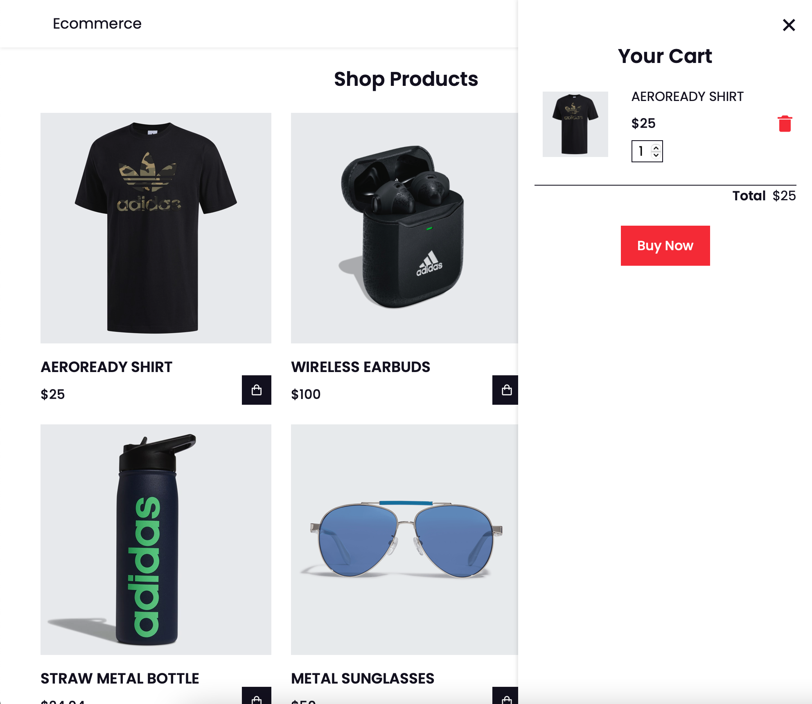

# Procesverslag
**Auteur:** -Sven Zoutman-

**De opdrachten:** [opdracht 1](opdracht1/index.html) en [opdracht 2](opdracht2/index.html)

Markdown is een simpele manier om HTML te schrijven.  
Markdown cheat cheet: [Hulp bij het schrijven van Markdown](https://github.com/adam-p/markdown-here/wiki/Markdown-Cheatsheet).

Nb. De standaardstructuur en de spartaanse opmaak van de README.md zijn helemaal prima. Het gaat om de inhoud van je procesverslag. Besteedt de tijd voor pracht en praal aan je website.

Nb. Door *open* toe te voegen aan een *details* element kun je deze standaard open zetten. Fijn om dat steeds voor de relevante stuk(ken) te doen.

## Bronnenlijst Opdracht 1
  1. -https://hyperpix.net/fonts/xbox-one-font/-
  2. -https://codersblock.com/blog/creating-glow-effects-with-css/-
  3. -https://usbrandcolors.com/xbox-one-colors/-
  4. -https://developer.mozilla.org/en-US/docs/Web/CSS/--*-
  5. -https://developer.mozilla.org/en-US/docs/Web/CSS/CSS_Animations/Using_CSS_animations- 
  6. -https://developer.mozilla.org/en-US/docs/Web/CSS/animation-direction-
  7. -https://developer.mozilla.org/en-US/docs/Web/CSS/@media/prefers-reduced-motion-
  8. -https://developer.mozilla.org/en-US/docs/Web/CSS/animation-play-state?retiredLocale=nl-

## Bronnenlijst Opdracht 2
  1. -https://listjs.com/-
  2. -https://codepen.io/shooft/pen/QWOdqEP/-
  3. -https://developer.mozilla.org/en-US/docs/Web/API/Event/preventDefault-
  4. -https://codepen.io/aobasar/pen/XWWMxQP-
  5. -https://www.w3schools.com/cssref/css_units.asp- 
  6. -https://en.ans.wiki/398/how-to-make-checkbox-filters-in-javascript/-
  7. -https://moderncss.dev/pure-css-custom-checkbox-style/-
  8. -https://developer.mozilla.org/en-US/docs/Web/CSS/Pseudo-classes-
  9. -https://angel-rs.github.io/css-color-filter-generator/-
  10. -https://www.endclothing.com/nl-
  11. -https://www.w3schools.com/css/css3_mediaqueries_ex.asp-

## Opdracht 1 plan

  
uitwerken na schetsen idee (voor week 2)

  ### Je storyboard:
  

  ### Je ambitie: 
  Aan deze technieken/punten wil ik werken:
  - Before/After
  - @keyframes
  - Custom Properties
 

## Opdracht 1 reflectie

  
uitwerken bij afronden opdracht (voor week 4)

  ### Je uitkomst - karakteristiek screenshot(s):
  

  

  ### Dit ging goed/Heb ik geleerd: 
  Ik heb geleerd hoe before en after werken. En hoe je moet animeren met @keyframes. Custom properties had ik ook nog nooit gebruikt.
  Korte omschrijving met plaatje(s)

  ### Dit was lastig/Is niet gelukt:
  Korte omschrijving met plaatje(s)
  Het was mij niet gelukt om deze vormpjes te maken. Het zou wel moeten kunnen met alleen css, maar dit is niet echt praktisch. Dat zou makkelijker kunnen met een svg.

  

  

## Opdracht 2 plan

  
uitwerken na schetsen idee (voor week 5)

  ### Je ontwerp:
  

  ### Je ambitie: 
  Aan deze technieken/punten wil ik werken:
  - Responsive
  - Javascript
  - List.js
  - Filteren

## Opdracht 2 test

  
uitwerken na testen (week 7)

  ### Bevinding 1: Toetsenbord bediening
  Tijdens het testen kon je nog niet met je toetsenbord de site bedienen.

  #### oplossing:
  Het is mij niet gelukt om dit probleem helemaal op te lossen. Omdat die bij images en list items geen focus state laat zien als je op tab drukt.

  ### Bevinding 2: Responsive
  De site was tijdens het testen nog niet responsive. Op mobiel zag die er wel goed uit.

  #### oplossing:
  Ik heb met media queries die op een x aantal pixels zijn ingesteld. Daardoor veranderd de indeling. Eerst zijn er maar 2 items naast elkaar en op zijn grootst 5 items. De filter veranderd ook van plek. Als ik extra tijd had, had ik ook nog de banner gedaan.

   ### Bevinding 3: Veel classes
  Tijdens het testen is opgevallen dat ik veel classen en id's heb gebruikt.

  #### oplossing:
  Deze hoeveelheid classes en id's zijn echt nodig. Als ik bij sommige de class weg haal en dan nth-type doe dan gaat die het toepassen op elke item met die naam. En het is ook nog voor het sorteren en filteren. Ook voor de wishlist en shopping-bag

   ### Bevinding 4: Weinig commentaar bij de code
  Tijdens het testen was mijn code nog niet echt voorzien van commentaar.

  #### oplossing:
  Ik heb de code netjes ingedeeld soort bij soort. Alle states bij elkaar, op chronologische volgorde van boven naar beneden. Er staat bij de javascript welk onderdeel het precies is. ook bij de html en css staat erbij waarvoor het is.

   ### Bevinding 5: Weinig states
  De states waren tijdens het testen nog niet compleet.

  #### oplossing: 
  De states wilde ik pas op het einde toevoegen als ik alle buttons had en de layout helemaal goed was. Nu zijn er wel hover en focus states. en ook een paar active states.

## Opdracht 2 reflectie

  
uitwerken bij afronden opdracht (voor week 8)

  ### Je uitkomst - karakteristiek screenshot(s):
  

  ### Dit ging goed/Heb ik geleerd: 
  Ik heb van die winkelwagen een wishlist gemaakt. Door overbodige elemten zoals quantity eruit te halen. Ik wilde nog een buy knop toevoegen in de wishlist maar deze deed het niet.

  

  ### Dit was lastig/Is niet gelukt:
  Het was mij niet gelukt om zelf een winkelwagen te maken of een wishlist. 
  Heb echt uren lopen zoeken op internet, maar ik vond bijna niks wat bruikbaar was en niet al te ingewikkeld. Ik had een paar maanden geleden een template gekocht voor een winkelwagen omdat ik wilde weten hoe dat er nou uit zag. Ik heb deze code hiervoor gebruikt. Deze code kan ik zeker niet helemaal uitleggen, maar snap wel wat er globaal gebeurd.

  

